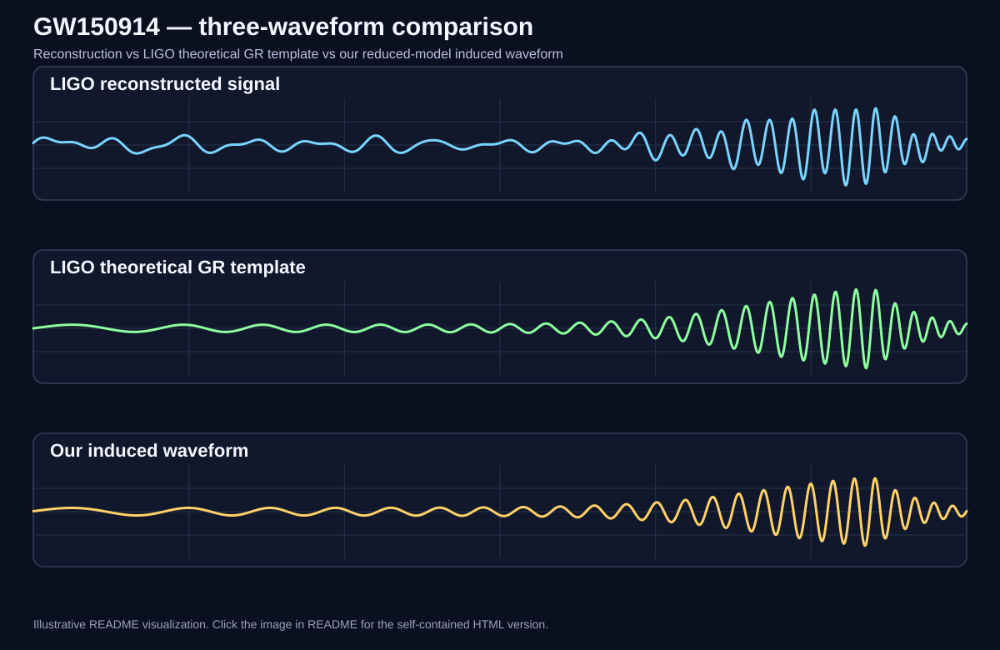

# BKQR GR — GW150914 Visualizer and Reduced Numerical Model

A Windows-native reduced general-relativistic model for a GW150914-like binary black-hole merger. The project combines a DX12 optical/lensing visualizer with a 3PN/3.5PN inspiral model, an NR-calibrated remnant transition, Kerr ringdown, and an induced far-observer gravitational-wave signal generated from the same evolving binary state.

> **Claim boundary:** this is a PN/NR-calibrated reduced model and visualization framework, not a full BSSN/Z4c numerical-relativity evolution or a replacement for LIGO/Virgo/KAGRA parameter estimation.

## Waveforms

The figure compares the **LIGO/GWOSC reconstructed signal**, a **LIGO theoretical GR template**, and **our induced reduced-model waveform**. The three signals are kept conceptually separate: detector reconstruction, reference GR template, and our model output.

## GW150914 comparison

| Quantity | Our reduced-model diagnostic | LIGO / GWOSC reference | Status |
|---|---:|---:|---|
| Detector-frame total mass | ~70.13 \(M_\odot\) | ~71.0 \(M_\odot\)* | close mass scale |
| Detector-frame chirp mass | ~29.44 \(M_\odot\) | ~30.7 \(M_\odot\)* | close chirp scale |
| Symmetric mass ratio \(\eta\) | ~0.2353 | ~0.249* | less secure |
| Component masses | ~43.55 + 26.57 \(M_\odot\) | ~38.1 + 33.0 \(M_\odot\)* | not robustly resolved |
| Final spin | ~0.6535 | ~0.68 | close |
| Predicted \(f_{220}\) | ~248.64 Hz | ~250 Hz | close |
| Predicted \(\tau_{220}\) | ~3.98 ms | ~4 ms | close |

\* Approximate detector-frame central values obtained from the published GWOSC/GWTC-2.1 source-frame central values using the central redshift \(z\approx0.10\). The published parameters are correlated, so these converted values are only convenient central-value comparisons.
